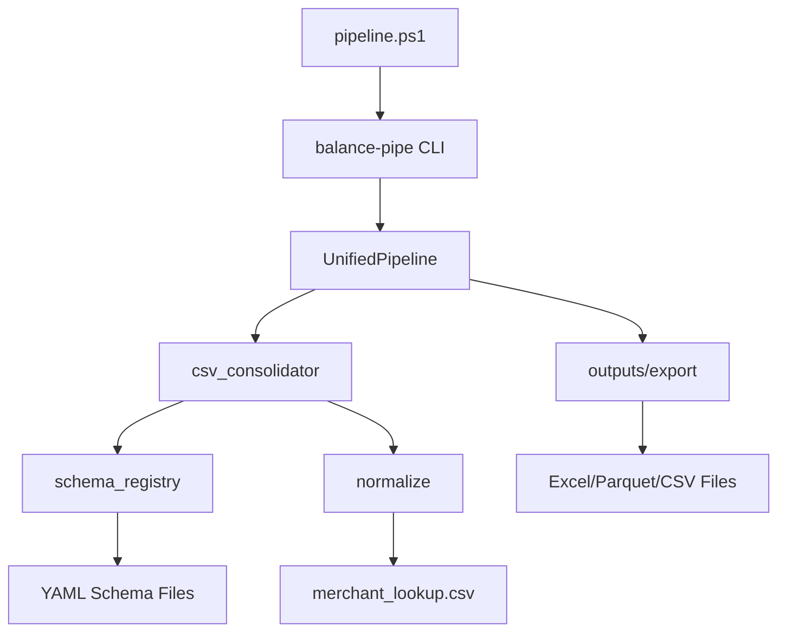

# BALANCE Repository Cleanup Manifest

**Generated:** 2025-08-10  
**Repository:** BALANCE-pyexcel Financial Analysis Pipeline  
**Analysis Scope:** Complete repository structure with 1000+ files across 134 Markdown files, 49 Python modules, 30 PowerShell scripts, and 519 CSV data files

---

## Executive Summary

This manifest provides a comprehensive analysis of the BALANCE repository structure, identifying core components, entry points, dependencies, and cleanup opportunities. The repository represents a mature financial analysis pipeline with extensive historical artifacts that require careful curation.

### Key Findings
- **Primary Entry Point:** `pipeline.ps1` - Master PowerShell orchestrator
- **Core Python Engine:** `src/balance_pipeline/` - Main processing modules (49 files)
- **Schema System:** `rules/` - CSV format definitions and mapping rules
- **Archive Volume:** ~90% of files are historical/archived content
- **Active Development:** Well-structured modern codebase in `src/` and `scripts/`

---

## Primary Pipeline Entry Points

### 🚀 **MASTER ENTRY POINT**
| File | Classification | Description | Dependencies |
|------|---------------|-------------|--------------|
| `pipeline.ps1` | **CORE** | Single master entry point for all operations. Orchestrates all pipeline functions through PowerShell interface. | Poetry, Python 3.11+, balance_pipeline modules |

### 🔧 **Python CLI Entry Points**
| Entry Point | Script/Module | Function | Classification |
|-------------|---------------|----------|---------------|
| `balance-pipe` | `src/balance_pipeline/main.py:main` | Primary Python CLI | **CORE** |
| `balance-analyze` | `src/balance_pipeline/analyzer.py:main` | Analysis operations | **CORE** |
| `balance-baseline` | `src/baseline_analyzer/cli.py:main` | Baseline calculations | **CORE** |
| `balance-merchant` | `src/balance_pipeline/cli_merchant.py:main_merchant` | Merchant operations | **CORE** |
| `balance-legacy-cli` | `src/balance_pipeline/cli.py:main_cli` | Legacy CLI compatibility | **CORE** |

---

## Core Directory Structure Classification

### 📁 **CORE DIRECTORIES** (Essential for operation)

#### **Primary Source Code**
```
src/                                    # CORE - Main Python packages
├── balance_pipeline/                   # CORE - Primary processing engine
│   ├── main.py                        # CORE - CLI entry point
│   ├── pipeline_v2.py                 # CORE - UnifiedPipeline orchestrator
│   ├── csv_consolidator.py            # CORE - CSV processing engine
│   ├── schema_registry.py             # CORE - Schema matching system
│   ├── config.py, config_v2.py        # CORE - Configuration management
│   ├── ingest.py, normalize.py         # CORE - Data ingestion & normalization
│   ├── processing.py, recon.py         # CORE - Processing & reconciliation
│   ├── merchant.py                     # CORE - Merchant normalization
│   ├── outputs.py, export.py           # CORE - Output generation
│   ├── errors.py, logging_config.py    # CORE - Error handling & logging
│   ├── utils.py, constants.py          # CORE - Utility functions
│   └── loaders/                        # CORE - Specialized data loaders
│       ├── expense_loader.py          # CORE - Expense data loading
│       ├── ledger_loader.py           # CORE - Ledger processing
│       ├── rent_alloc_loader.py       # CORE - Rent allocation
│       └── rent_history_loader.py     # CORE - Rent history
└── baseline_analyzer/                  # CORE - Balance analysis tools
    ├── cli.py                         # CORE - Baseline CLI
    ├── baseline_math.py               # CORE - Mathematical calculations
    ├── processing.py, recon.py        # CORE - Analysis processing
    └── config.py                      # CORE - Analysis configuration
```

#### **Configuration & Rules**
```
config/                                # CORE - Configuration files
├── balance_analyzer.yaml             # CORE - Analysis settings
├── business_rules.yml                # CORE - External business rules
├── canonical_schema_v2.yaml          # CORE - Schema definitions
└── *.json                           # CORE - Generated analysis configs

rules/                                 # CORE - Schema and mapping definitions
├── schema_registry.yml               # CORE - Bank CSV format definitions
├── merchant_lookup.csv               # CORE - Merchant normalization rules
├── jordyn_*.yaml                     # CORE - Jordyn's bank schemas
├── ryan_*.yaml                       # CORE - Ryan's bank schemas
└── canonical_schema.yml              # CORE - Canonical schema definition
```

#### **Essential Scripts**
```
scripts/                               # CORE - Utility and operational scripts
├── powershell/                       # CORE - PowerShell utilities
│   ├── Clean-Repository.ps1          # CORE - Repository maintenance
│   ├── Run-*.ps1                     # CORE - Analysis runners
│   └── commit-files.ps1              # CORE - Git operations
├── utilities/                        # CORE - Key utility tools
│   ├── dispute_analyzer_gui.py       # CORE - GUI analysis tool
│   ├── dispute_analyzer.py           # CORE - Dispute analysis
│   └── quick_powerbi_prep.py         # CORE - Power BI preparation
├── run_baseline.py                   # CORE - Baseline analysis runner
└── quick_check.py                    # CORE - System validation
```

#### **Testing & Quality**
```
tests/                                # CORE - Test suite (comprehensive)
├── test_*.py                         # CORE - 25+ test modules
├── fixtures/                         # CORE - Test data samples
└── balance_analyzer/                 # CORE - Analyzer-specific tests

pytest.ini                           # CORE - Test configuration
pyproject.toml                       # CORE - Project dependencies & config
poetry.lock                          # CORE - Dependency lock file
```

### 📁 **ESSENTIAL OPERATIONAL DIRECTORIES**

```
csv_inbox/                            # CORE - Input directory for CSV files
├── Ryan/                            # CORE - Ryan's financial data
└── Jordyn/                          # CORE - Jordyn's financial data

output/                              # CORE - Generated analysis outputs
├── *.xlsx, *.csv, *.parquet        # CORE - Analysis results
└── unified_pipeline/                # CORE - Pipeline-specific outputs

workbook/                            # CORE - Excel templates and outputs
├── template/                        # CORE - Excel templates
└── *.parquet, *.xlsx               # CORE - Workbook outputs

logs/                               # CORE - Runtime logging (if present)
```

### 📚 **DOCUMENTATION DIRECTORIES**

#### **Active Documentation**
```
docs/                               # DOCUMENTATION - Comprehensive guides
├── AGENTS.md                       # DOCUMENTATION - AI coding guidelines
├── ARCHITECTURE.md                 # DOCUMENTATION - System architecture
├── BUSINESS_RULES.md              # DOCUMENTATION - Business logic
├── CONFIGURATION_GUIDE.md         # DOCUMENTATION - Config reference
├── PRODUCTION_OPERATIONS.md       # DOCUMENTATION - Operations guide
├── PROJECT_SUMMARY.md             # DOCUMENTATION - Project overview
├── cli_usage.md                   # DOCUMENTATION - CLI reference
├── developer_setup.md             # DOCUMENTATION - Development setup
├── quick_start.md                 # DOCUMENTATION - Getting started
├── user_guide.md                  # DOCUMENTATION - User documentation
└── project_status/                # DOCUMENTATION - Project status tracking
    ├── COMPREHENSIVE_PROJECT_STATUS.md  # DOCUMENTATION
    ├── IMPLEMENTATION_ROADMAP.md        # DOCUMENTATION
    ├── NEXT_STEPS_IMMEDIATE.md         # DOCUMENTATION
    └── OUTSTANDING_ISSUES.md           # DOCUMENTATION

README.md                          # CORE - Primary project documentation
CHANGELOG.md                       # DOCUMENTATION - Version history
CONTRIBUTING.md                    # DOCUMENTATION - Contribution guidelines
PIPELINE_COMMANDS.md               # DOCUMENTATION - Command reference
LICENSE                           # CORE - MIT License
```

---

## Archive Directory Classification

### 📦 **ARCHIVE STRUCTURE** (~90% of repository content)

```
archive/                              # ARCHIVED - Historical content
├── ARCHIVE_CONTENTS.md              # DOCUMENTATION - Archive index
├── README.md                        # DOCUMENTATION - Archive guide
├── analysis/                        # ARCHIVED - Historical analysis scripts
│   └── analysis/*.py               # DEPRECATED - Old analysis tools (7 files)
├── corrections/                     # ARCHIVED - Historical correction scripts
│   └── corrections/*.py            # DEPRECATED - Old correction tools (6 files)
├── deprecated/                      # ARCHIVED - Explicitly deprecated content
├── experimental/                    # ARCHIVED - Experimental features
├── generated/                       # ARCHIVED - Historical generated content
│   ├── artifacts/                  # ARCHIVED - Old pipeline outputs
│   ├── audit_reports/              # ARCHIVED - Historical audit reports (24 files)
│   ├── data/                       # ARCHIVED - Processed historical data
│   ├── fixtures/                   # ARCHIVED - Old test fixtures
│   ├── logs/                       # ARCHIVED - Historical log files (13 files)
│   ├── reports/                    # ARCHIVED - Generated reports (6 files)
│   └── sample_data_multi/          # ARCHIVED - Sample datasets
├── investigations/                  # ARCHIVED - Historical investigations
│   └── investigations/*.py         # DEPRECATED - Old investigation tools (5 files)
├── legacy/                         # ARCHIVED - Legacy repository content
│   └── _ARCHIVE_FOR_REVIEW_BEFORE_DELETION/  # DEPRECATED - Massive legacy archive
├── redundant/                      # ARCHIVED - Redundant documentation
│   ├── REPOSITORY_CLEANUP_PLAN.md  # REDUNDANT - Superseded by this manifest
│   └── REPOSITORY_CLEANUP_SUMMARY.md # REDUNDANT - Old cleanup summary
├── scripts/                        # ARCHIVED - Historical scripts
│   └── *.py                       # DEPRECATED - Old analysis scripts (13 files)
├── tools/                          # ARCHIVED - Historical development tools
│   └── *.py                       # DEPRECATED - Old development tools (10 files)
├── utilities/                      # ARCHIVED - Historical utilities
│   └── *.py                       # DEPRECATED - Old utility scripts (27 files)
└── workflows/                      # ARCHIVED - Placeholder for future CI/CD
```

---

## File-by-File Classification

### 🗂️ **ROOT LEVEL FILES**

| File | Classification | Description | Action |
|------|---------------|-------------|---------|
| `pipeline.ps1` | **CORE** | Master entry point - orchestrates all operations | **PRESERVE** |
| `README.md` | **CORE** | Primary documentation with ASCII header | **PRESERVE** |
| `CHANGELOG.md` | **DOCUMENTATION** | Version history and release notes | **PRESERVE** |
| `PIPELINE_COMMANDS.md` | **DOCUMENTATION** | Command reference guide | **PRESERVE** |
| `CONTRIBUTING.md` | **DOCUMENTATION** | Contribution guidelines | **PRESERVE** |
| `LICENSE` | **CORE** | MIT License | **PRESERVE** |
| `pyproject.toml` | **CORE** | Python project configuration and dependencies | **PRESERVE** |
| `poetry.lock` | **CORE** | Dependency lock file for reproducible builds | **PRESERVE** |
| `pytest.ini` | **CORE** | Test configuration | **PRESERVE** |
| `mkdocs.yml` | **DOCUMENTATION** | Documentation site configuration | **PRESERVE** |
| `BALANCE-pyexcel.pbix` | **CORE** | Power BI template file | **PRESERVE** |
| `CLEANUP_MANIFEST.md` | **DOCUMENTATION** | This analysis document | **PRESERVE** |

### 🐍 **PYTHON SOURCE CODE** (49 files in src/)

#### **balance_pipeline Module** (37 files)
| File | Classification | Purpose | Dependencies |
|------|---------------|---------|--------------|
| `main.py` | **CORE** | CLI entry point and argument parsing | argparse, pipeline_v2 |
| `pipeline_v2.py` | **CORE** | UnifiedPipeline orchestrator class | csv_consolidator, errors |
| `csv_consolidator.py` | **CORE** | CSV processing engine | pandas, schema_registry |
| `schema_registry.py` | **CORE** | Schema matching and validation | PyYAML, schema files |
| `config.py`, `config_v2.py` | **CORE** | Configuration management | pydantic, YAML configs |
| `ingest.py` | **CORE** | Data ingestion and file handling | pandas, pathlib |
| `normalize.py` | **CORE** | Data normalization and cleaning | pandas, merchant lookup |
| `processing.py` | **CORE** | Core data processing logic | pandas, numpy |
| `recon.py` | **CORE** | Reconciliation algorithms | pandas, datetime |
| `merchant.py` | **CORE** | Merchant name normalization | CSV lookup, regex |
| `outputs.py`, `export.py` | **CORE** | Output generation (Excel, Parquet, CSV) | openpyxl, pyarrow |
| `cli.py`, `cli_merchant.py` | **CORE** | Command-line interfaces | argparse, click |
| `analyzer.py` | **CORE** | Financial analysis engine | pandas, matplotlib |
| `errors.py` | **CORE** | Custom exception hierarchy | Standard Python |
| `logging_config.py` | **CORE** | Structured logging configuration | structlog, rich |
| `utils.py` | **CORE** | Utility functions | Standard Python |
| `constants.py` | **CORE** | Application constants | Standard Python |
| **loaders/** | **CORE** | Specialized data loaders (4 files) | pandas, specialized logic |

#### **baseline_analyzer Module** (12 files)
| File | Classification | Purpose | Dependencies |
|------|---------------|---------|--------------|
| `cli.py` | **CORE** | Baseline analyzer CLI | argparse, processing |
| `baseline_math.py` | **CORE** | Mathematical calculations for balance analysis | pandas, numpy |
| `processing.py` | **CORE** | Baseline processing logic | pandas, config |
| `recon.py` | **CORE** | Baseline reconciliation | pandas, datetime |
| `config.py` | **CORE** | Baseline analyzer configuration | YAML, pydantic |

### 📜 **POWERSHELL SCRIPTS** (30 files)

#### **Active Scripts** (scripts/powershell/)
| Script | Classification | Purpose | Dependencies |
|--------|---------------|---------|--------------|
| `Clean-Repository.ps1` | **CORE** | Repository maintenance and cleanup | Git, filesystem |
| `Run-Analysis.ps1` | **CORE** | Analysis orchestration | Poetry, Python |
| `Run-BalanceAnalysis.ps1` | **CORE** | Balance analysis runner | Poetry, Python |
| `Run-ComprehensiveAnalyzer.ps1` | **CORE** | Comprehensive analysis runner | Poetry, Python |
| `commit-files.ps1` | **CORE** | Git operations automation | Git |
| `Check-RequiredFiles.ps1` | **CORE** | File validation utility | Filesystem |
| `Make-Previews.ps1` | **CORE** | Data preview generation | Python, CSV files |
| **Others** (7 files) | **CORE** | Setup, migration, analysis utilities | Various |

### 🧪 **TEST SUITE** (25+ test files)

#### **Core Tests** (tests/)
| Test File | Classification | Coverage | Dependencies |
|-----------|---------------|----------|--------------|
| `test_unified_pipeline.py` | **CORE** | End-to-end pipeline testing | pytest, fixtures |
| `test_csv_consolidator.py` | **CORE** | CSV processing validation | pytest, pandas |
| `test_schema_*.py` | **CORE** | Schema system validation | pytest, YAML |
| `test_cli_*.py` | **CORE** | CLI interface testing | pytest, argparse |
| `test_processing.py` | **CORE** | Processing logic validation | pytest, pandas |
| **Balance Analyzer Tests** (6 files) | **CORE** | Baseline analyzer validation | pytest, numpy |

### ⚙️ **CONFIGURATION FILES**

#### **Active Configuration**
| File | Classification | Purpose | Format |
|------|---------------|---------|---------|
| `config/balance_analyzer.yaml` | **CORE** | Analysis parameters and settings | YAML |
| `config/business_rules.yml` | **CORE** | External business rules configuration | YAML |
| `config/canonical_schema_v2.yaml` | **CORE** | Schema definitions | YAML |
| `rules/schema_registry.yml` | **CORE** | Bank CSV format definitions | YAML |
| `rules/merchant_lookup.csv` | **CORE** | Merchant normalization rules | CSV |
| **Bank Schemas** (8 files) | **CORE** | Individual bank format definitions | YAML |

---

## Dependencies Analysis

### 🔗 **Primary Dependency Flow**



### 📦 **External Dependencies** (from pyproject.toml)

#### **Runtime Dependencies**
- **pandas** ^2.2.3 - Core data manipulation
- **pyarrow** >=16.0.0 - Parquet file handling
- **openpyxl** ^3.1 - Excel file operations
- **duckdb** ^1.2.2 - SQL operations on local data
- **pydantic** ^2.7 - Configuration validation
- **PyYAML** ^6.0.1 - YAML configuration parsing
- **structlog** ^24.1.0 - Structured logging
- **rich** ^13.7.0 - Rich terminal output

#### **PDF Processing Dependencies**
- **camelot-py** ^0.11.0 - Advanced PDF table extraction
- **pdfplumber** ^0.11 - PDF text/table extraction
- **opencv-python** ^4.11.0.86 - Computer vision for PDF processing

#### **Report Generation**
- **reportlab** ^4.0 - PDF report generation

#### **Development Dependencies**
- **pytest** ^8.3.5 - Testing framework
- **black** ^25.1.0 - Code formatting
- **ruff** ^0.4.0 - Fast Python linting
- **mypy** ^1.10.0 - Static type checking
- **mkdocs-material** ^9.5 - Documentation generation

### 🔄 **Internal Module Dependencies**

#### **Core Processing Chain**
1. `main.py` → `pipeline_v2.py` → `csv_consolidator.py`
2. `csv_consolidator.py` → `schema_registry.py` → `rules/*.yaml`
3. `csv_consolidator.py` → `normalize.py` → `merchant.py`
4. `pipeline_v2.py` → `outputs.py` / `export.py`

#### **Configuration Dependencies**
- All modules → `config.py` → `config/*.yaml`
- Schema system → `rules/schema_registry.yml` → Individual bank schemas
- Merchant normalization → `rules/merchant_lookup.csv`

---

## Potential Issues and Concerns

### ⚠️ **High Priority Issues**

1. **Archive Volume Overwhelming Active Code**
   - ~90% of files are archived content
   - Risk of confusion for new developers
   - Repository clone size unnecessarily large

2. **Duplicate Configuration Files**
   - `config.py` vs `config_v2.py` suggests migration in progress
   - Multiple schema definition formats (YAML vs JSON)
   - Some configuration files may be outdated

3. **Test Coverage Gaps**
   - While comprehensive, some legacy code paths may lack coverage
   - Integration tests for full pipeline workflow needed

### ⚠️ **Medium Priority Issues**

4. **Documentation Synchronization**
   - 134 Markdown files across repository
   - High risk of outdated documentation in archive areas
   - Some documentation may be duplicated

5. **PowerShell Script Dependencies**
   - 30 PowerShell scripts with varying dependency requirements
   - Platform compatibility concerns (Windows-centric)
   - Some scripts may be redundant

6. **CSV Data File Management**
   - 519 CSV files throughout repository
   - Many appear to be historical test data
   - Risk of sensitive data exposure in archived samples

### ⚠️ **Low Priority Issues**

7. **Legacy Code Maintenance**
   - Significant amount of deprecated code in archive
   - Potential security vulnerabilities in unmaintained code
   - Resource consumption for repository operations

8. **Build System Complexity**
   - Poetry + PowerShell + Python CLI creates complex build chain
   - Multiple entry points may confuse users
   - Version synchronization across tools

---

## Cleanup Recommendations

### 🧹 **Immediate Actions**

1. **Archive Directory Management**
   - Move `archive/legacy/_ARCHIVE_FOR_REVIEW_BEFORE_DELETION/` to separate repository
   - Compress historical generated data files
   - Remove duplicate legacy documentation

2. **Configuration Consolidation**
   - Standardize on single configuration system (`config_v2.py`)
   - Remove deprecated configuration files
   - Validate all YAML/JSON configuration files

3. **Documentation Cleanup**
   - Remove duplicate documentation from archive areas
   - Update README to reflect current architecture
   - Consolidate project status documentation

### 🧹 **Secondary Actions**

4. **Test Data Management**
   - Archive non-essential CSV test files
   - Keep only representative samples in `tests/fixtures/`
   - Document test data requirements

5. **Script Consolidation**
   - Review PowerShell scripts for redundancy
   - Standardize on `pipeline.ps1` as primary interface
   - Archive unused utility scripts

6. **Dependency Management**
   - Review optional dependencies for actual usage
   - Update dependency versions for security
   - Validate Poetry lock file consistency

---

## File Preservation Strategy

### 🛡️ **MUST PRESERVE** (Critical for operation)

#### **Core Application Files**
- `pipeline.ps1` - Master entry point
- `src/balance_pipeline/` - All 37 Python modules
- `src/baseline_analyzer/` - All 12 Python modules
- `tests/` - All test files and fixtures
- `rules/` - All schema and mapping files
- `config/` - All active configuration files

#### **Essential Documentation**
- `README.md` - Primary documentation
- `CHANGELOG.md` - Version history
- `PIPELINE_COMMANDS.md` - Command reference
- `docs/` active documentation (exclude archive duplicates)

#### **Infrastructure Files**
- `pyproject.toml` - Project configuration
- `poetry.lock` - Dependency lock
- `pytest.ini` - Test configuration
- `LICENSE` - Legal requirements

### 🔄 **CONDITIONAL PRESERVE** (Evaluate for cleanup)

#### **Scripts Directory**
- `scripts/powershell/` - Review for redundancy
- `scripts/utilities/` - Keep essential tools only
- `scripts/*.py` - Evaluate individual utility scripts

#### **Archive Directory**
- `archive/generated/reports/` - Keep final reports only
- `archive/scripts/` - Archive after review
- `archive/tools/` - Archive after functionality validation

### ❌ **SAFE TO REMOVE** (After verification)

#### **Bulk Archive Content**
- `archive/legacy/_ARCHIVE_FOR_REVIEW_BEFORE_DELETION/`
- `archive/generated/audit_reports/` (historical)
- `archive/generated/data/_archive/`
- `archive/deprecated/`
- `archive/redundant/`

#### **Historical Generated Content**
- Old log files in `archive/generated/logs/`
- Historical CSV data files (keep samples only)
- Duplicate documentation files

---

## Migration Path

### Phase 1: Critical Preservation
1. Backup entire repository
2. Preserve all CORE and DOCUMENTATION classified files
3. Create archive summary document before deletion

### Phase 2: Archive Management
1. Export `archive/legacy/` to separate repository
2. Compress large historical data files
3. Remove duplicate documentation

### Phase 3: Configuration Cleanup
1. Consolidate configuration systems
2. Remove deprecated Python modules
3. Update documentation to reflect changes

### Phase 4: Final Optimization
1. Review PowerShell script redundancy
2. Optimize test data volume
3. Update README with cleaned structure

---

## Conclusion

The BALANCE repository represents a mature, well-architected financial analysis system with a clear separation between active code and historical artifacts. The primary challenge is managing the overwhelming volume of archived content (90% of files) that obscures the clean, modern codebase.

**Key Strengths:**
- Single master entry point (`pipeline.ps1`)
- Well-structured Python packages in `src/`
- Comprehensive test suite
- Clear schema-based configuration system
- Professional documentation

**Primary Recommendation:**
Execute a careful cleanup focusing on archive volume reduction while preserving the excellent core architecture and all operational components. The active codebase is production-ready and should be preserved in its entirety.

**Repository Post-Cleanup Size Estimate:**
- Current: 1000+ files, ~134 MB
- Post-cleanup: ~200-300 files, ~20-30 MB
- Reduction: ~75-80% file count, ~80-85% size reduction

This cleanup will significantly improve developer experience while maintaining full operational capability and preserving valuable historical context through selective archiving.