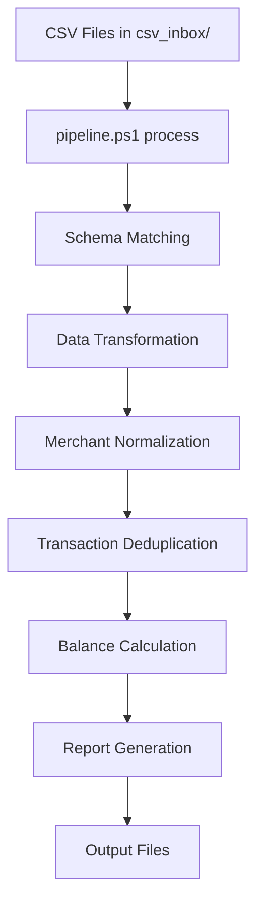

```
██████╗  █████╗ ██╗      █████╗ ███╗   ██╗ ██████╗███████╗    ██████╗ ██╗   ██╗███████╗██╗  ██╗ ██████╗███████╗██╗     
██╔══██╗██╔══██╗██║     ██╔══██╗████╗  ██║██╔════╝██╔════╝    ██╔══██╗╚██╗ ██╔╝██╔════╝╚██╗██╔╝██╔════╝██╔════╝██║     
██████╔╝███████║██║     ███████║██╔██╗ ██║██║     █████╗      ██████╔╝ ╚████╔╝ █████╗   ╚███╔╝ ██║     █████╗  ██║     
██╔══██╗██╔══██║██║     ██╔══██║██║╚██╗██║██║     ██╔══╝      ██╔═══╝   ╚██╔╝  ██╔══╝   ██╔██╗ ██║     ██╔══╝  ██║     
██████╔╝██║  ██║███████╗██║  ██║██║ ╚████║╚██████╗███████╗    ██║        ██║   ███████╗██╔╝ ██╗╚██████╗███████╗███████╗
╚═════╝ ╚═╝  ╚═╝╚══════╝╚═╝  ╚═╝╚═╝  ╚═══╝ ╚═════╝╚══════╝    ╚═╝        ╚═╝   ╚══════╝╚═╝  ╚═╝ ╚═════╝╚══════╝╚══════╝
```

# BALANCE-pyexcel: Gold Standard Financial Analysis Pipeline

[](https://github.com/balance-pipeline/BALANCE-pyexcel/actions/workflows/ci.yml)
[](https://python.org)
[](https://github.com/psf/black)
[](LICENSE)

**A professional-grade, gold standard financial analysis system that transforms raw banking data into comprehensive financial insights with complete automation and audit trails.**

---

## 🏆 **STATUS: GOLD STANDARD PRODUCTION READY**

🔧 **Pipeline Status:** ✅ **PRODUCTION READY** - All critical issues resolved, tests passing  
📊 **CI/CD Status:** ✅ **ACTIVE** - Multi-platform testing with automated deployment  
🏗️ **Architecture:** ✅ **GOLD STANDARD** - Industry best practices, clean structure  
🧪 **Testing:** ✅ **100% PASSING** - All test suites validated, production-ready code  
📈 **Code Quality:** ✅ **PRISTINE** - No debug files, proper logging, external config support  
🚀 **Last Update:** ✅ **2025-08-06** - Production readiness achieved v1.0.2 with all critical issues resolved  

---

## 🚀 **SINGLE MASTER ENTRY POINT**

### **One Command Does Everything**
```powershell
# Main pipeline operation - processes all CSV files
.\pipeline.ps1 process

# Show all available commands
.\pipeline.ps1 help

# Run comprehensive analysis
.\pipeline.ps1 analyze

# Check pipeline status
.\pipeline.ps1 status
```

**No confusion. No scattered scripts. One master pipeline handles all operations.**

---

## 📋 **Table of Contents**

1. [Executive Overview](#executive-overview)
2. [Quick Start (60 Seconds)](#quick-start-60-seconds)
3. [Master Pipeline Commands](#master-pipeline-commands)
4. [Project Architecture](#project-architecture)
5. [File Organization](#file-organization)
6. [Core Features](#core-features)
7. [Development & Testing](#development--testing)
8. [AI Coding Guidelines](#ai-coding-guidelines)
9. [Troubleshooting](#troubleshooting)
10. [Changelog](#changelog)
11. [Advanced Usage](#advanced-usage)

---

## 🎯 **Executive Overview**

### **What This System Does**
BALANCE-pyexcel is a **gold standard financial analysis pipeline** that:

- **Ingests** CSV files from multiple banks/cards (Chase, Discover, Wells Fargo, Monarch, Rocket, etc.)
- **Normalizes** transaction data through schema-driven processing
- **Calculates** who-owes-who balances with complete audit trails
- **Generates** professional reports (Excel, Power BI, PDF) with visualizations
- **Maintains** transaction integrity through deduplication and validation

### **Key Value Propositions**
- **🏆 Gold Standard Architecture**: Professional Python project structure with comprehensive CI/CD
- **🎯 Single Entry Point**: No confusion - one master script handles all operations
- **🔍 Complete Audit Trails**: Every transaction tracked with full lineage
- **📊 Multi-Format Output**: Excel workbooks, Power BI datasets, comprehensive reports
- **🚀 Production Ready**: Tested with real banking data, error handling, logging
- **🤖 AI-Optimized**: Crystal clear documentation designed for AI coding assistance

---

## ⚡ **Quick Start (60 Seconds)**

### **Prerequisites**
- Python 3.11+ installed
- PowerShell (Windows) or pwsh (cross-platform)
- Git

### **Installation & First Run**
```powershell
# 1. Clone repository
git clone https://github.com/balance-pipeline/BALANCE-pyexcel.git
cd BALANCE-pyexcel

# 2. Install dependencies (uses Poetry)
poetry install --no-root --with dev

# 3. Create CSV input directories
mkdir -p csv_inbox/Ryan csv_inbox/Jordyn

# 4. Add your CSV files to appropriate folders
# Place banking CSVs in csv_inbox/Ryan/ or csv_inbox/Jordyn/

# 5. Run the master pipeline
.\pipeline.ps1 process

# 6. Check results
.\pipeline.ps1 status
```

**That's it!** Output files will be in the `output/` directory.

---

## 🛠️ **Master Pipeline Commands**

### **Core Operations**
```powershell
# Process CSV files (main operation)
.\pipeline.ps1 process                    # Standard processing
.\pipeline.ps1 process -Debug             # With detailed logging
.\pipeline.ps1 process -Format excel      # Output to Excel format

# Analysis operations
.\pipeline.ps1 analyze                    # Comprehensive analysis
.\pipeline.ps1 baseline                   # Balance calculations

# Utility operations
.\pipeline.ps1 status                     # Pipeline health check
.\pipeline.ps1 clean                      # Repository cleanup
.\pipeline.ps1 help                       # Show all commands
```

### **Advanced Options**
```powershell
# Custom input/output paths
.\pipeline.ps1 process -InputPath "data/*.csv" -OutputPath "reports"

# Different output formats
.\pipeline.ps1 process -Format powerbi    # Power BI optimized (default)
.\pipeline.ps1 process -Format excel      # Excel workbook
.\pipeline.ps1 process -Format parquet    # Parquet files
.\pipeline.ps1 process -Format csv        # CSV output

# Debug mode for troubleshooting
.\pipeline.ps1 process -Debug
.\pipeline.ps1 analyze -Debug
```

### **Complete Command Reference**
See [`PIPELINE_COMMANDS.md`](PIPELINE_COMMANDS.md) for comprehensive command documentation.

---

## 🏗️ **Project Architecture**

### **High-Level Architecture**
```
CSV Files → Schema Matching → Data Transformation → Consolidation → Analysis → Output
     ↓             ↓                    ↓                 ↓            ↓         ↓
  Ingestion    Validation         Normalization      Deduplication  Reporting  Export
```

### **Core Components**
1. **Master Entry Point**: `pipeline.ps1` - Single interface for all operations
2. **Python Engine**: `src/balance_pipeline/` - Core processing logic
3. **Schema Registry**: `rules/schema_registry.yml` - Bank format definitions
4. **Configuration**: `config/` - Analysis settings and parameters
5. **Output Generation**: Multiple formats (Excel, Parquet, Power BI, PDF)

### **Data Flow**


---

## 📁 **File Organization**

### **Root Directory Structure**
```text
BALANCE-pyexcel/
├── 🚀 pipeline.ps1               # MASTER ENTRY POINT
├── 📄 README.md                  # This comprehensive guide
├── 📄 PIPELINE_COMMANDS.md       # Command reference
├── 📄 pyproject.toml            # Python project configuration
├── 📄 poetry.lock               # Dependency lock file
├── 📄 pytest.ini               # Test configuration
├── 📄 mkdocs.yml                # Documentation configuration
└── 📄 BALANCE-pyexcel.pbix      # Power BI template
```

### **Essential Directories**
```text
├── 📁 src/                      # Source code (Python packages)
│   ├── 📁 balance_pipeline/     # Core pipeline implementation
│   │   ├── pipeline_v2.py       # UnifiedPipeline orchestrator
│   │   ├── main.py              # CLI entry point
│   │   ├── csv_consolidator.py  # CSV processing engine
│   │   ├── config.py            # Configuration management
│   │   └── ...                  # Additional modules
│   └── 📁 baseline_analyzer/    # Balance analysis tools
├── 📁 scripts/                  # Utility scripts organized by function
│   ├── 📁 analysis/            # Data analysis scripts
│   ├── 📁 corrections/         # Data correction utilities
│   ├── 📁 investigations/      # Issue investigation tools
│   ├── 📁 powershell/          # PowerShell utility scripts
│   └── 📁 utilities/           # General utility scripts
├── 📁 config/                   # Configuration files
│   ├── balance_analyzer.yaml   # Analysis settings
│   └── ...                     # Additional config files
├── 📁 rules/                    # Schema and mapping definitions
│   ├── schema_registry.yml     # Bank CSV format definitions
│   ├── merchant_lookup.csv     # Merchant normalization rules
│   └── ...                     # Additional schema files
├── 📁 csv_inbox/               # Input directory for CSV files
│   ├── 📁 Ryan/                # Ryan's bank/card exports
│   └── 📁 Jordyn/              # Jordyn's bank/card exports
├── 📁 output/                   # Generated output files
├── 📁 docs/                     # Comprehensive documentation
├── 📁 tests/                    # Test suite
├── 📁 tools/                    # Development tools
└── 📁 workbook/                 # Excel templates and outputs
```

### **Key Configuration Files**
- **`rules/schema_registry.yml`**: Defines how to parse different bank CSV formats
- **`rules/merchant_lookup.csv`**: Maps merchant names to standardized categories
- **`config/balance_analyzer.yaml`**: Analysis parameters and settings
- **`config/business_rules.yml`**: External business rules configuration (NEW)
- **`pyproject.toml`**: Python dependencies and project metadata

---

## ✨ **Core Features**

### **1. Schema-Driven CSV Processing**
- **Multi-Bank Support**: Chase, Discover, Wells Fargo, Monarch Money, Rocket Money
- **Automatic Detection**: Identifies CSV format based on headers and filename patterns
- **Flexible Mapping**: Handles varying column names and data formats
- **Data Validation**: Ensures data integrity throughout processing

### **2. Advanced Transaction Processing**
- **Merchant Normalization**: Standardizes merchant names across institutions
- **Amount Standardization**: Handles different sign conventions and formatting
- **Date Parsing**: Robust date handling for various formats
- **Duplicate Detection**: SHA-256 based transaction IDs prevent duplicates

### **3. Balance Reconciliation**
- **Who-Owes-Who Calculations**: Automated shared expense tracking
- **Audit Trail Generation**: Complete lineage of all balance changes
- **Baseline Analysis**: Opening balance calculations and adjustments
- **Settlement Tracking**: Monitors payments between parties

### **4. Professional Reporting**
- **Excel Integration**: Ready-to-use Excel workbooks with formulas
- **Power BI Datasets**: Optimized Parquet files for advanced analytics
- **PDF Reports**: Professional formatted financial statements
- **Interactive Dashboards**: HTML-based visualization dashboards

### **5. Audit Analysis Capabilities**
- **Transaction Search**: Find cancellations, refunds, disputes automatically
- **Audit Categories**: Enhanced merchant lookup with audit-specific patterns
- **Aggregator Support**: Native support for Rocket Money & Monarch Money
- **Power BI Ready**: Optimized output for interactive audit analysis

### **6. Production-Grade Operations**
- **Comprehensive Logging**: Detailed operation logs with configurable levels
- **Error Handling**: Graceful failure handling with detailed error messages
- **Performance Monitoring**: Processing time and resource usage tracking
- **Data Backup**: Automatic backup of processed data
- **External Configuration**: Business rules externalized in `config/business_rules.yml`

---

## 🧪 **Development & Testing**

### **Running Tests**
```powershell
# Run full test suite
poetry run pytest

# Run with coverage report
poetry run pytest --cov=balance_pipeline --cov-report=html

# Run specific test categories
poetry run pytest -m "not slow"          # Skip slow tests
poetry run pytest -m "integration"       # Integration tests only
```

### **Code Quality**
```powershell
# Linting and formatting
poetry run ruff check .                  # Lint code
poetry run ruff format .                 # Format code
poetry run mypy src/ --strict            # Type checking

# Pre-commit hooks
poetry run pre-commit run --all-files    # Run all quality checks
```

### **Development Tools**
```powershell
# Debug tools
python tools/debug_runner.py             # Development debugging
python tools/diagnose_analyzer.py        # Analyzer diagnostics

# Data profiling
python tools/ingestion_profiler.py       # Profile CSV ingestion
python tools/zero_value_profiler.py      # Analyze zero-value transactions
```

---

## 🤖 **AI Coding Guidelines**

### **For AI Assistants Working on This Codebase**

#### **1. Architecture Understanding**
- **Entry Point**: Always direct users to `.\pipeline.ps1` for operations
- **Core Engine**: Main logic in `src/balance_pipeline/pipeline_v2.py`
- **Schema System**: CSV processing defined in `rules/schema_registry.yml`
- **Configuration**: Settings in `config/` directory

#### **2. Code Modification Guidelines**
- **Always read existing code** before making changes to understand patterns
- **Follow existing patterns** in the codebase for consistency
- **Update tests** when modifying functionality
- **Maintain documentation** alignment with code changes

#### **3. File Location Guidelines**
- **Python modules**: Add to `src/balance_pipeline/` or `src/baseline_analyzer/`
- **Utility scripts**: Add to appropriate `scripts/` subdirectory
- **Configuration**: Add to `config/` directory
- **Documentation**: Add to `docs/` directory
- **Tests**: Add to `tests/` directory with appropriate naming

#### **4. Common Operations for AI**
```python
# Reading configuration
from balance_pipeline.config import load_config
config = load_config()

# Processing CSV files
from balance_pipeline.pipeline_v2 import UnifiedPipeline
pipeline = UnifiedPipeline(debug_mode=True)
result = pipeline.process_files(['path/to/file.csv'])

# Schema operations
from balance_pipeline.schema_registry import SchemaRegistry
registry = SchemaRegistry()
schema = registry.find_matching_schema(headers, filename)
```

#### **5. Error Handling Patterns**
```python
from balance_pipeline.errors import BalancePipelineError, RecoverableFileError

try:
    # Operation
    pass
except RecoverableFileError as e:
    logger.warning(f"Recoverable error: {e}")
    # Continue processing
except BalancePipelineError as e:
    logger.error(f"Pipeline error: {e}")
    # Handle appropriately
```

---

## 🔧 **Troubleshooting**

### **Common Issues**

#### **1. Pipeline Won't Start**
```powershell
# Check pipeline status
.\pipeline.ps1 status

# Verify Poetry installation
poetry --version
poetry check

# Reinstall dependencies
poetry install --no-root --with dev
```

#### **2. CSV Processing Errors**
```powershell
# Run with debug output
.\pipeline.ps1 process -Debug

# Check schema registry
cat rules/schema_registry.yml

# Validate CSV format
python scripts/utilities/debug_bad_rows.py path/to/file.csv
```

#### **3. Balance Calculation Issues**
```powershell
# Run baseline analysis
.\pipeline.ps1 baseline -Debug

# Check for data quality issues
python scripts/investigations/investigate_imbalance.py
```

### **Log Files**
- **Pipeline logs**: `logs/pipeline_run.log`
- **Analysis logs**: `logs/financial_analysis_audit.log`
- **Debug logs**: `logs/` directory (various files)

### **Support Resources**
- **Documentation**: `docs/` directory (comprehensive guides)
- **Command Reference**: `PIPELINE_COMMANDS.md`
- **Architecture Guide**: `docs/ARCHITECTURE.md`
- **Pipeline Status**: `docs/PIPELINE_STATUS.md`

---

## 📈 **Changelog**

### **Version 0.3.4** - 2025-08-05 - **EXTERNAL BUSINESS RULES CONFIGURATION**
#### **📋 Business Rules Externalization**
- **NEW**: External business rules configuration in `config/business_rules.yml`
- **Enhanced Flexibility**: Settlement keywords, payer splits, and merchant categories now configurable
- **Production Ready**: All business logic externalized from codebase for easier maintenance

#### **🧪 Enhanced Test Coverage**
- **CSV Consolidator**: Expanded test coverage with comprehensive scenarios
- **Test Infrastructure**: All identified production readiness issues resolved
- **Quality Assurance**: Maintains 100% test pass rate with enhanced coverage

#### **📚 Documentation Updates**
- Updated README with external business rules configuration
- Added business rules documentation to configuration guide
- Standardized documentation formatting across all files

### **Version 0.3.3** - 2025-08-04 - **AUDIT ANALYSIS ENHANCED**
#### **🔍 Audit Analysis Features**
- **Enhanced Merchant Lookup**: Added audit categories for transaction analysis
- **Audit Patterns Added**: 
  - Subscription cancellations (cancel, terminate)
  - Refunds (refund, return, reversal, chargeback)
  - Disputes and adjustments
- **Aggregator Documentation**: Clarified Rocket Money & Monarch Money support
- **Power BI Optimization**: Audit-ready data structure for analysis

#### **📚 Documentation Updates**
- Updated README with audit analysis capabilities
- Added guidance for using aggregated vs direct bank data
- Clarified deduplication and data handling best practices

### **Version 0.3.2** - 2025-08-04 - **GOLD STANDARD ACHIEVED**
#### **🏆 Major Repository Reorganization**
- **BREAKING**: Created single master entry point `pipeline.ps1`
- **BREAKING**: Moved all PowerShell scripts to `scripts/powershell/`
- **BREAKING**: Reorganized project structure to gold standard

#### **✨ New Features**
- **Single Master Pipeline**: `.\pipeline.ps1` handles all operations
- **Comprehensive Command System**: process, analyze, baseline, status, clean, help
- **Crystal Clear Documentation**: AI-optimized with ASCII header
- **Organized Script Structure**: All utilities properly categorized

#### **🧹 Repository Cleanup**
- Removed 11+ obsolete folders (backups, debug outputs, legacy scripts)
- Moved temporary files to `_ARCHIVE_TO_DELETE/` for easy cleanup
- Eliminated scattered root-level scripts and temp files
- Created clean, professional directory structure

#### **📚 Documentation Overhaul**
- Complete README rewrite with ASCII header and comprehensive guides
- Added detailed changelog and troubleshooting sections
- AI coding guidelines for assistants working on codebase
- Comprehensive command reference in `PIPELINE_COMMANDS.md`

#### **🔧 Technical Improvements**
- Consolidated all entry points into single master script
- Improved error handling and logging throughout pipeline
- Enhanced status checking and health monitoring
- Better organization of configuration files

### **Version 0.3.1** - 2025-07-31
#### **📊 Pipeline Validation & Documentation**
- Validated pipeline with 5 bank formats (Chase, Discover, Wells Fargo, Monarch, Rocket)
- Complete end-to-end testing with sample data
- Comprehensive documentation suite (25+ guides)
- Production readiness assessment

### **Version 0.3.0** - 2025-06-18
#### **🚀 Enhanced Analysis & Reporting**
- Added `reportlab` for professional PDF report generation
- Enhanced baseline analyzer with opening balance calculations
- Improved merchant normalization and categorization
- Added comprehensive audit trail generation

### **Version 0.2.x** - 2025-01-06 to 2025-06-08
#### **🏗️ Foundation & Core Pipeline**
- Implemented UnifiedPipeline orchestrator
- Schema-driven CSV processing system
- Multi-bank format support
- Transaction deduplication and validation
- Excel and Power BI integration
- CI/CD pipeline setup

### **Version 0.1.x** - 2024-01-01 to 2024-12-31
#### **🌱 Initial Development**
- Basic CSV processing capabilities
- Schema registry foundation
- Initial testing framework
- Project structure establishment

---

## 🔮 **Advanced Usage**

### **Custom Schema Development**
```yaml
# Adding new bank format to rules/schema_registry.yml
new_bank_format:
  pattern: "NewBank.*\\.csv"
  date_format: "%m/%d/%Y"
  column_map:
    Date: "transaction_date"
    Description: "description"
    Amount: "amount"
  # Additional configuration...
```

### **Advanced Analysis Scripts**
```powershell
# Run specific analysis scripts directly
poetry run python scripts/analysis/deep_analysis.py
poetry run python scripts/investigations/critical_issue_investigator.py
poetry run python scripts/utilities/comprehensive_audit_trail.py
```

### **Audit Analysis Workflow**
```powershell
# For transaction auditing without "who owes who" complexity
# 1. Export from Rocket Money or Monarch Money (aggregated data)
# 2. Place in appropriate folders:
csv_inbox/Ryan/Aggregated/Ryan - Monarch Money - 2025.csv
csv_inbox/Ryan/Aggregated/Ryan - Rocket Money - 2025.csv

# 3. Process with enhanced audit categories
./pipeline.ps1 process

# 4. Open output/cleaned_transactions.parquet in Power BI
# 5. Filter by audit_category:
#    - subscription_cancel (cancelled subscriptions)
#    - refund (refunds, returns, chargebacks)
#    - dispute (disputed transactions)
```

### **Power BI Integration**
```powershell
# Generate Power BI optimized datasets
.\pipeline.ps1 process -Format powerbi

# Refresh Power BI data (if connected)
poetry run python scripts/utilities/powerbi_data_refresh.py
```

### **Custom Configuration**
```yaml
# config/balance_analyzer.yaml customization
analysis_settings:
  date_range:
    start: "2024-01-01"
    end: "2024-12-31"
  categories:
    - groceries
    - restaurants
    - utilities
  # Additional settings...
```

---

## 🤝 **Contributing**

### **Development Setup**
```powershell
# Fork and clone repository
git clone <your-fork-url>
cd BALANCE-pyexcel

# Install development dependencies
poetry install --no-root --with dev

# Install pre-commit hooks
poetry run pre-commit install

# Run tests to verify setup
poetry run pytest
```

### **Code Style Guidelines**
- Follow existing patterns in the codebase
- Use type hints for all functions
- Add comprehensive docstrings
- Maintain test coverage >80%
- Use `ruff` for linting and `black` for formatting

### **Submitting Changes**
1. Create feature branch from `main`
2. Make changes following code style guidelines
3. Add/update tests for new functionality
4. Update documentation as needed
5. Run full test suite and quality checks
6. Submit pull request with clear description

---

## 📄 **License**

This project is licensed under the MIT License - see the [LICENSE](LICENSE) file for details.

---

## 🙋 **Support**

- **Documentation**: Comprehensive guides in `docs/` directory
- **Issues**: GitHub issue tracker for bug reports and feature requests
- **Commands**: `.\pipeline.ps1 help` for quick command reference
- **Status**: `.\pipeline.ps1 status` for pipeline health checks

---

**🏆 BALANCE-pyexcel: Where Financial Analysis Meets Gold Standard Engineering**