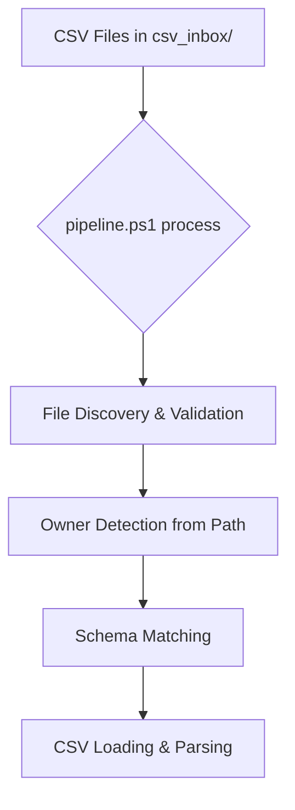
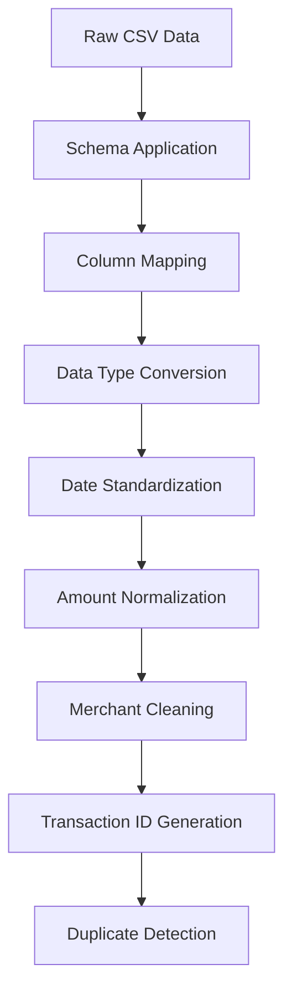
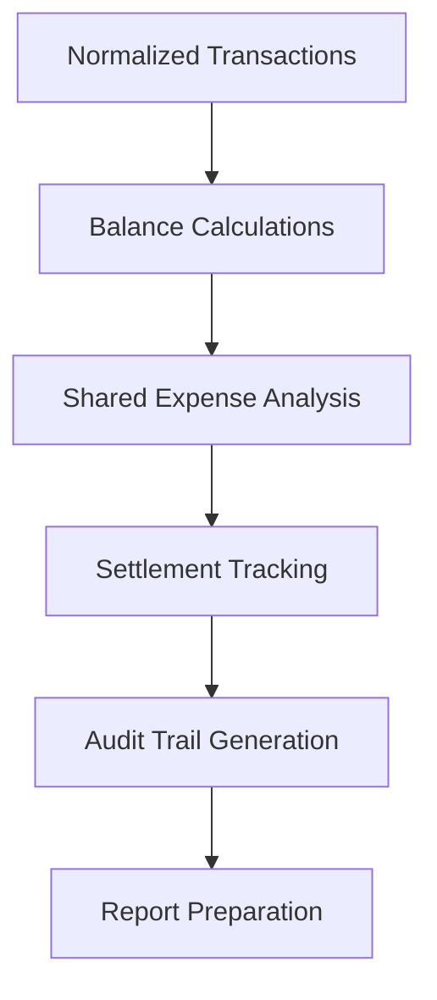
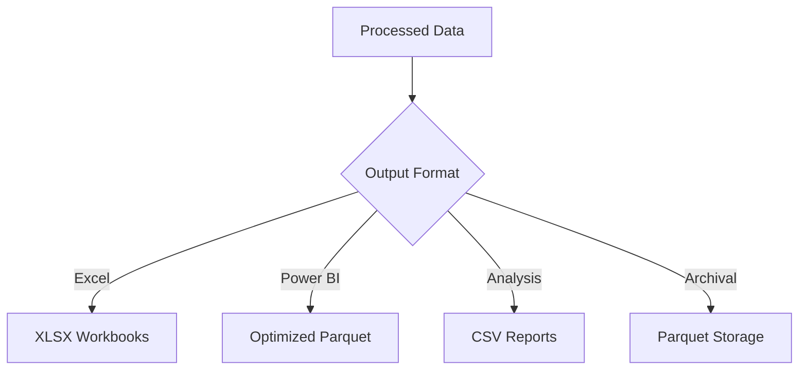

# BALANCE-pyexcel: Gold Standard System Architecture

**Status**: ✅ **GOLD STANDARD PRODUCTION READY**  
**Version**: 0.3.4  
**Last Updated**: 2025-08-05

---

## 🏆 **Executive Architecture Overview**

BALANCE-pyexcel implements a **gold standard financial analysis architecture** designed with industry best practices, comprehensive error handling, and crystal-clear interfaces optimized for both human developers and AI coding assistance.

### **🎯 Core Design Principles**
- **Single Entry Point**: One master script (`pipeline.ps1`) handles all operations
- **Clean Separation**: Distinct layers for UI, orchestration, processing, and storage
- **Schema-Driven Processing**: Configurable CSV parsing for multiple bank formats
- **Comprehensive Audit Trails**: Every operation logged and traceable
- **AI-Optimized**: Clear patterns and documentation for AI assistant integration

---

## 🚀 **Single Master Entry Point Architecture**

### **Command Flow**
```
User Command → pipeline.ps1 → Python CLI → Core Engine → Output
     ↓              ↓             ↓            ↓          ↓
 Interface    Orchestration   Business     Processing   Results
```

### **Master Pipeline Script (`pipeline.ps1`)**
```powershell
# Single interface for all operations
.\pipeline.ps1 process    # Main CSV processing
.\pipeline.ps1 analyze    # Comprehensive analysis  
.\pipeline.ps1 baseline   # Balance calculations
.\pipeline.ps1 status     # Health monitoring
.\pipeline.ps1 clean      # Repository maintenance
.\pipeline.ps1 help       # Documentation
```

**Key Benefits:**
- **No confusion** - single entry point for all operations
- **Consistent interface** - same parameter patterns across commands
- **Error handling** - centralized error reporting and recovery
- **Status monitoring** - built-in health checks and diagnostics

---

## 🏗️ **System Architecture Layers**

### **Layer 1: User Interface & Orchestration**
```
┌─────────────────────────────────────────────────────────────┐
│ MASTER ENTRY POINT: pipeline.ps1                           │
├─────────────────────────────────────────────────────────────┤
│ • Single command interface                                  │
│ • Parameter validation and routing                          │
│ • Error handling and user feedback                          │
│ • Status monitoring and health checks                       │
└─────────────────────────────────────────────────────────────┘
```

### **Layer 2: Python CLI Commands**
```
┌─────────────────────────────────────────────────────────────┐
│ PYTHON CLI LAYER                                            │
├─────────────────────────────────────────────────────────────┤
│ • balance-pipe: Main CSV processing                         │
│ • balance-analyze: Comprehensive analysis                   │
│ • balance-baseline: Balance calculations                    │
│ • balance-merchant: Merchant operations                     │
│ • balance-legacy-cli: Legacy compatibility                  │
└─────────────────────────────────────────────────────────────┘
```

### **Layer 3: Core Processing Engine**
```
┌─────────────────────────────────────────────────────────────┐
│ CORE ENGINE: src/balance_pipeline/                          │
├─────────────────────────────────────────────────────────────┤
│ • UnifiedPipeline: Main orchestrator                        │
│ • CSV Consolidator: Schema-driven processing                │
│ • Schema Registry: Format definitions                       │
│ • Merchant Normalization: Name standardization              │
│ • Transaction Processing: Deduplication & validation        │
└─────────────────────────────────────────────────────────────┘
```

### **Layer 4: Configuration & Rules**
```
┌─────────────────────────────────────────────────────────────┐
│ CONFIGURATION LAYER                                         │
├─────────────────────────────────────────────────────────────┤
│ • Schema Registry: rules/schema_registry.yml                │
│ • Merchant Lookup: rules/merchant_lookup.csv               │
│ • Analysis Config: config/balance_analyzer.yaml             │
│ • Business Rules: config/business_rules.yml (NEW)          │
│ • Python Config: pyproject.toml                            │
└─────────────────────────────────────────────────────────────┘
```

### **Layer 5: Data Storage & Output**
```
┌─────────────────────────────────────────────────────────────┐
│ DATA & OUTPUT LAYER                                         │
├─────────────────────────────────────────────────────────────┤
│ • Input: csv_inbox/ (organized by owner)                   │
│ • Processing: Temporary DataFrames in memory                │
│ • Output: Multiple formats (Excel, Parquet, CSV, Power BI)  │
│ • Logs: Comprehensive operation logging                     │
│ • Archives: Historical data in data/_archive/               │
└─────────────────────────────────────────────────────────────┘
```

---

## 🔄 **Detailed Data Flow Architecture**

### **1. Input Phase: CSV Ingestion**


**Implementation Details:**
- **File Discovery**: Scans `csv_inbox/Ryan/` and `csv_inbox/Jordyn/` recursively
- **Owner Tagging**: Automatically assigns owner based on directory structure
- **Schema Matching**: Uses filename patterns and headers to identify bank format
- **Error Handling**: Graceful handling of malformed or unrecognized files

### **2. Processing Phase: Data Transformation**


**Schema Registry System:**
```yaml
# Example schema definition
chase_checking:
  pattern: ".*Chase.*Checking.*\\.csv"
  date_format: "%m/%d/%Y"
  column_map:
    Date: "date"
    Description: "description"
    Amount: "amount"
  sign_rule: "credit_positive"
  derived_columns:
    Account: "Chase Checking"
    AccountType: "checking"
```

### **3. Analysis Phase: Financial Calculations**


### **4. Output Phase: Multi-Format Export**


---

## 🎯 **Core Component Architecture**

### **UnifiedPipeline Class (`src/balance_pipeline/pipeline_v2.py`)**
```python
class UnifiedPipeline:
    """Main orchestrator for CSV processing workflow."""
    
    def __init__(self, schema_mode: str = "flexible", debug_mode: bool = False):
        # Initialize with configuration
        
    def process_files(self, file_paths: Sequence[PathLike]) -> pd.DataFrame:
        # Main processing workflow
        # 1. Validate inputs
        # 2. Process each file through schema system
        # 3. Consolidate results
        # 4. Apply deduplication
        # 5. Return processed DataFrame
```

**Key Methods:**
- `process_files()`: Main entry point for CSV processing
- `_validate_inputs()`: Input validation and sanitization
- `_process_single_file()`: Individual file processing
- `_consolidate_results()`: Multi-file result combination

### **CSV Consolidator (`src/balance_pipeline/csv_consolidator.py`)**
```python
def process_csv_files(
    file_paths: List[Path],
    schema_registry_path: Path,
    merchant_lookup_path: Path
) -> pd.DataFrame:
    """Process multiple CSV files through schema-driven transformation."""
```

**Processing Steps:**
1. **Schema Loading**: Load bank format definitions
2. **File Processing**: Apply appropriate schema to each CSV
3. **Data Transformation**: Normalize dates, amounts, merchants
4. **Quality Assurance**: Validate data integrity
5. **Consolidation**: Combine all processed data

### **Schema Registry System (`src/balance_pipeline/schema_registry.py`)**
```python
class SchemaRegistry:
    """Manages bank CSV format definitions and matching."""
    
    def find_matching_schema(self, headers: List[str], filename: str) -> Dict:
        # Match CSV format based on headers and filename
        
    def apply_schema_transformations(self, df: pd.DataFrame, schema: Dict) -> pd.DataFrame:
        # Apply schema-defined transformations
```

---

## 📊 **Configuration Architecture**

### **Schema Registry (`rules/schema_registry.yml`)**
Defines how to process different bank CSV formats:

```yaml
schemas:
  chase_checking:
    pattern: ".*Chase.*Checking.*\\.csv"
    date_format: "%m/%d/%Y"
    column_map:
      Date: "date"
      Description: "description"
      Amount: "amount"
    sign_rule: "credit_positive"
    
  discover_card:
    pattern: ".*Discover.*\\.csv"
    date_format: "%m/%d/%Y"
    column_map:
      "Trans. Date": "date"
      Description: "description"
      Amount: "amount"
    sign_rule: "debit_negative"
```

### **Merchant Lookup (`rules/merchant_lookup.csv`)**
Standardizes merchant names across institutions:

```csv
raw_merchant,clean_merchant,category
"AMAZON.COM*123ABC","Amazon","online_shopping"
"WAL-MART #1234","Walmart","groceries"
"STARBUCKS #12345","Starbucks","dining"
```

### **Business Rules Configuration (`config/business_rules.yml`)**
Externalizes key business logic for easy customization:
```yaml
# Settlement payment methods
settlement_keywords:
  - venmo
  - zelle
  - cash app

# Expense sharing percentages  
payer_split:
  ryan_pct: 0.43
  jordyn_pct: 0.57

# Transaction categorization rules
merchant_categories:
  Groceries: [fry, safeway, walmart]
  Utilities: [electric, gas, water]
```

### **Analysis Configuration (`config/balance_analyzer.yaml`)**
Controls analysis parameters and settings:

```yaml
analysis_settings:
  date_range:
    start: "2024-01-01"
    end: "2024-12-31"
  categories:
    - groceries
    - restaurants
    - utilities
  shared_expense_rules:
    default_split: 0.5
    categories_to_split:
      - groceries
      - utilities
```

---

## 🛠️ **Development Architecture**

### **Project Structure Pattern**
```
src/balance_pipeline/           # Core business logic
├── pipeline_v2.py            # Main orchestrator
├── csv_consolidator.py       # CSV processing engine
├── schema_registry.py        # Schema management
├── config.py                 # Configuration handling
├── errors.py                 # Custom exception classes
└── utils.py                  # Shared utilities

scripts/                       # Organized utility scripts
├── analysis/                 # Data analysis tools
├── corrections/              # Data correction utilities
├── investigations/           # Issue debugging tools
├── powershell/               # PowerShell scripts
└── utilities/                # General utilities

tests/                        # Comprehensive test suite
├── test_pipeline_v2.py       # Core pipeline tests
├── test_schema_registry.py   # Schema system tests
├── fixtures/                 # Test data
└── conftest.py              # Test configuration
```

### **Error Handling Architecture**
```python
# Custom exception hierarchy
class BalancePipelineError(Exception):
    """Base exception for all pipeline errors."""

class RecoverableFileError(BalancePipelineError):
    """Error that allows processing to continue."""

class FatalSchemaError(BalancePipelineError):
    """Critical error requiring immediate termination."""
```

### **Logging Architecture**
```python
# Structured logging configuration
LOG_FORMAT = "%(asctime)s | %(levelname)-8s | %(name)s | %(message)s"

# Multiple log files for different purposes
logs/
├── pipeline_run.log          # Main pipeline operations
├── financial_analysis_audit.log  # Analysis operations
├── monarch_processing.log    # Bank-specific processing
└── schema_evidence/          # Schema matching evidence
```

---

## 🤖 **AI Assistant Integration Architecture**

### **AI-Friendly Design Patterns**

#### **1. Clear Entry Points**
```python
# Always direct AI to single entry point
def main_pipeline_operation():
    """Use: .\pipeline.ps1 process"""
    
# Core processing logic clearly exposed
from balance_pipeline.pipeline_v2 import UnifiedPipeline
pipeline = UnifiedPipeline(debug_mode=True)
result = pipeline.process_files(file_paths)
```

#### **2. Consistent Configuration Patterns**
```python
# Configuration loading follows standard pattern
from balance_pipeline.config import load_config
config = load_config()  # Loads from multiple sources

# Schema access follows standard pattern
from balance_pipeline.schema_registry import SchemaRegistry
registry = SchemaRegistry()
schema = registry.find_matching_schema(headers, filename)
```

#### **3. Predictable Error Handling**
```python
# All operations use consistent error handling
try:
    result = pipeline.process_files(file_paths)
except RecoverableFileError as e:
    logger.warning(f"Recoverable error: {e}")
    # Continue processing other files
except BalancePipelineError as e:
    logger.error(f"Pipeline error: {e}")
    # Handle according to error type
```

#### **4. Standard Testing Patterns**
```python
# Tests follow consistent patterns
def test_pipeline_processing():
    """Test main pipeline functionality."""
    pipeline = UnifiedPipeline(debug_mode=True)
    result = pipeline.process_files([test_csv_path])
    assert len(result) > 0
    assert 'TxnID' in result.columns
```

---

## 🔐 **Security Architecture**

### **Data Protection**
- **Local Processing**: All data remains on local machine
- **No Network Transmission**: No data sent to external services
- **Secure File Handling**: Proper permission checks and validation
- **Input Sanitization**: CSV content validation and sanitization

### **Configuration Security**
- **No Hardcoded Secrets**: All sensitive data in configuration files
- **Environment Variable Support**: Secure configuration via environment
- **Path Validation**: Strict validation of file paths and inputs

---

## 📈 **Performance Architecture**

### **Memory Management**
- **Streaming Processing**: Large CSV files processed in chunks
- **Memory Monitoring**: Built-in memory usage tracking
- **Garbage Collection**: Explicit cleanup of large DataFrames

### **Processing Optimization**
- **Parallel Processing**: Multi-file processing where possible
- **Caching**: Schema and configuration caching for performance
- **Lazy Loading**: Data loaded only when needed

### **Storage Optimization**
- **Parquet Format**: Efficient columnar storage for large datasets
- **Compression**: Automatic compression for archived data
- **Indexing**: Optimized data structures for fast access

---

## 🎯 **Future Architecture Considerations**

### **Scalability Enhancements**
- **Database Integration**: Optional database backend for large datasets
- **Distributed Processing**: Support for processing across multiple machines
- **Cloud Integration**: Optional cloud storage and processing capabilities

### **Advanced Features**
- **Machine Learning**: Automated categorization and anomaly detection
- **Real-time Processing**: Live bank feed integration
- **Advanced Analytics**: Time series analysis and forecasting

---

**🏆 Architecture Status: Gold Standard Achieved - Ready for Production Use**